# Arquitetura e requisitos (material para o Capítulo 3)

## Requisitos funcionais

| ID | Requisito | Comando |
|---|---|---|
| RF01 | Inspecionar o ambiente sem coletar hostname, usuário ou caminhos pessoais | `doctor` |
| RF02 | Importar CSVs locais ou baixar URLs autorizadas, com manifesto SHA-256 | `import-data`, `download` |
| RF03 | Inferir esquema, rótulos, contagens e qualidade lendo em lotes | `inspect` |
| RF04 | Remover inválidos, deduplicar globalmente, excluir grupos benigno+ataque, classificar conflitos entre ataques e amostrar por estrato | `prepare` |
| RF05 | Verificar cobertura das 7 categorias e integridade da amostra | `verify-data` |
| RF06 | Particionar, ajustar o pré-processamento no treino e congelar hashes | `freeze` |
| RF07 | Ajustar IF, SGD-OCSVM (Nyström) e AE só com benignos | `train` |
| RF08 | Calibrar limiares apenas com benignos de validation_calibration | `calibrate` |
| RF09 | Produzir predições, métricas, métricas por categoria e tempos | `evaluate` |
| RF10 | Gerar tabelas, figuras e síntese factual | `report` |
| RF11 | Verificar vazamento, reprodutibilidade e integridade | `verify-run` |
| RF12 | Orquestrar até o teste inicial com retomada, sem tocar o confirmatório | `run-initial` |

## Requisitos não funcionais

- **Reprodutibilidade:** `uv.lock`; sementes explícitas; seleção e partição por hash criptográfico,
  independentes da ordem de leitura; configuração resolvida gravada em `protocol.json`.
- **Rastreabilidade:** SHA-256 dos arquivos brutos, dos artefatos congelados, dos modelos e da árvore
  de código-fonte; log de exposição dos testes que só aceita acréscimos.
- **Proteção da avaliação:** `evaluate` recusa artefatos alterados ou código diferente do congelado; o
  confirmatório exige liberação explícita.
- **Escalabilidade local:** leitura em lotes (pyarrow) e agregação em disco (DuckDB com limite de memória).
- **Honestidade dos resultados:** denominador nulo vira "não definido", nunca zero; dados sintéticos
  são marcados e isolados em `tests/output/`.
- **Portabilidade:** Linux, WSL e Windows nativo (caminhos com `pathlib`), sem Docker.

## Diagrama

```mermaid
flowchart LR
  A[CSVs oficiais] -->|import-data / download| B[data/raw + raw_manifest.json]
  B -->|inspect| C[staging Parquet<br/>schema, quality, propostas]
  C -->|autor confirma mapeamento,<br/>allowlist e split.mode| D{{configs/}}
  C -->|prepare| E[vector_groups + sample.parquet<br/>data_quality, sample_counts]
  D --> E
  E -->|verify-data + freeze| F[runs/&lt;protocol_id&gt;<br/>partitions, features, preprocessor,<br/>protocol.json]
  F -->|train| G[models/&lt;modelo&gt;/seed_&lt;s&gt;]
  G -->|calibrate: validation_calibration| H[thresholds.json + models_manifest.json]
  H -->|evaluate test_initial| I[predictions + metrics + timings]
  I -->|report| J[results_initial.md + figures/]
  I -->|verify-run| K[verification.json]
  H -.->|somente com --release-confirmatory| L[evaluate test_confirmatory]
```

## Módulos (`src/tc2_iot/`)

| Módulo | Responsabilidade |
|---|---|
| `cli.py` | comandos e argumentos |
| `config.py` | leitura, esquema, validação e hash da configuração |
| `environment.py` | inspeção do ambiente e limites de threads (threadpoolctl + torch) |
| `provenance.py` | versão do código, log de exposição, JSON |
| `data/acquire.py` | importação, download seguro, detecção de HTML, extração segura de zip |
| `data/inspect.py` | staging em Parquet, esquema, rótulos, qualidade, propostas de mapeamento e allowlist |
| `data/clean.py` | views DuckDB, exclusões, agrupamento de vetores, duplicatas e conflitos |
| `data/sample.py` | amostragem estratificada e `prepare` |
| `data/split.py` | alocação sistemática por estrato, partições, conflitos no espaço efetivo, checagens |
| `data/preprocess.py` | constantes do treino + StandardScaler |
| `models/*.py` | interface comum `fit / anomaly_score / save / load` e os três modelos |
| `calibration.py`, `evaluation.py`, `benchmark.py` | limiar, métricas, tempos |
| `protocol.py` | ciclo de vida do protocolo (freeze → verify-run) |
| `reporting.py` | figuras PNG/PDF e `results_*.md` |

## Bibliotecas (versões instaladas em `runs/environment.json`)

NumPy, scikit-learn (IsolationForest, Nystroem, SGDOneClassSVM, StandardScaler, métricas), PyTorch
(CPU), PyArrow (leitura de CSV em lotes, Parquet), DuckDB (agregação em disco), pandas (tabelas pequenas),
Matplotlib (figuras), psutil, PyYAML, joblib, threadpoolctl e pytest. O Polars, previsto na especificação,
não foi instalado: pyarrow + DuckDB já cobrem a ingestão, e duas engines duplicariam o mecanismo.

## Artefatos por protocolo (`runs/<protocol_id>/`)

`protocol.json`, `environment.json`, `raw_manifest.json`, `label_mapping.yaml`, `feature_catalog.csv`,
`data_quality.json`, `sample_counts*.csv`, `partitions.parquet`, `features.parquet`,
`preprocessor.joblib`, `preprocessing.json`, `models/`, `thresholds.json`, `models_manifest.json`,
`predictions/<split>/`, `predictions_<split>.parquet`, `metrics.csv`, `category_metrics.csv`,
`timings.csv`, `ae_training_history.csv`, `figures/`, `results_initial.md` e `verification.json`.
Em `runs/`: `environment.json` e `test_exposure_log.jsonl`.
